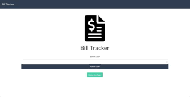

# Bill Tracker
Deployed site [here]("https://bill-track.firebaseapp.com/#/")

Bill Tracker is an app that allows a user to sign in with their name (or add themselves) and track their bills to watch for patterns!  On the users page, the app renders all the bills they have already added.  Additionally, the app allows users to add a bill with a form, edit a bill that already exists, or delete bills from their list.  The app also contains a toggleable chart for a handy visualization of all the users bills!

## Screen Shot

## Local Installation

Upon cloning this repo, run `npm install`.  Once the packages and dependencies have been installed, run the script `npm run serve`.  The project should now be running on `http://localhost:8080/`!

## Author Contact Information
Reach David Aspesi at the following places:

[GitHub](https://github.com/DavidNAspesi/)  
[LinkedIn](https://www.linkedin.com/in/davidnaspesi/)  
DavidNAspesi@gmail.com

## License

Copyright 2018 David Aspesi

Permission is hereby granted, free of charge, to any person obtaining a copy of this software and associated documentation files (the "Software"), to deal in the Software without restriction, including without limitation the rights to use, copy, modify, merge, publish, distribute, sublicense, and/or sell copies of the Software, and to permit persons to whom the Software is furnished to do so, subject to the following conditions:

The above copyright notice and this permission notice shall be included in all copies or substantial portions of the Software.

THE SOFTWARE IS PROVIDED "AS IS", WITHOUT WARRANTY OF ANY KIND, EXPRESS OR IMPLIED, INCLUDING BUT NOT LIMITED TO THE WARRANTIES OF MERCHANTABILITY, FITNESS FOR A PARTICULAR PURPOSE AND NONINFRINGEMENT. IN NO EVENT SHALL THE AUTHORS OR COPYRIGHT HOLDERS BE LIABLE FOR ANY CLAIM, DAMAGES OR OTHER LIABILITY, WHETHER IN AN ACTION OF CONTRACT, TORT OR OTHERWISE, ARISING FROM, OUT OF OR IN CONNECTION WITH THE SOFTWARE OR THE USE OR OTHER DEALINGS IN THE SOFTWARE.